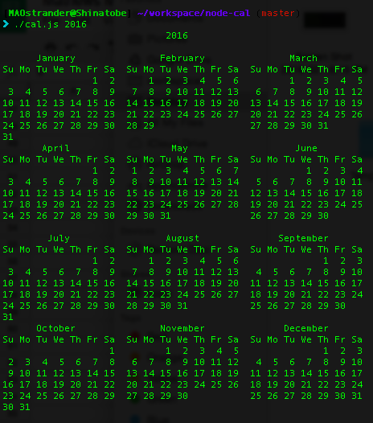

# node-cal

##About
This is an exercise recreating the command line app 'cal' written as a Node.js module.

This was also a lesson in Test Driven Development. Mocha and Chai were used in conjuction with Travis CI for distributed testing & Coveralls for test coverage.

##Requirements
Since it's a command line app, you will need access to your terminal.
You will also need Git and NPM

##Installing
1. In the directory you want to install, Git Clone this repo
2. Change Directory into the cloned repo
3. In that main directory run `npm install`
4. To be able to run the file directly type `chmod +x cal.js`

##Running
To run the app, simply type ./cal.js in the main directory of the cloned repo
To run it in other locations you will need to type the full path to the file.

##Usage
Running `./cal.js` with no arguments displays the current month's calendar in the console

Running `./cal.js <year>` with a four digit year between 1753 and 9999 (inclusive) will display a full calendar year

If the year chosen is outside the range or illegible

Running `./cal.js <month> <year>` with a valid year and month will display that particular month and year.  1753 and 9999 (inclusive) will display a full calendar year.

A valid month must either be a number between 1-12 inclusive, the full month name, or a three letter abreviation of a month name.

